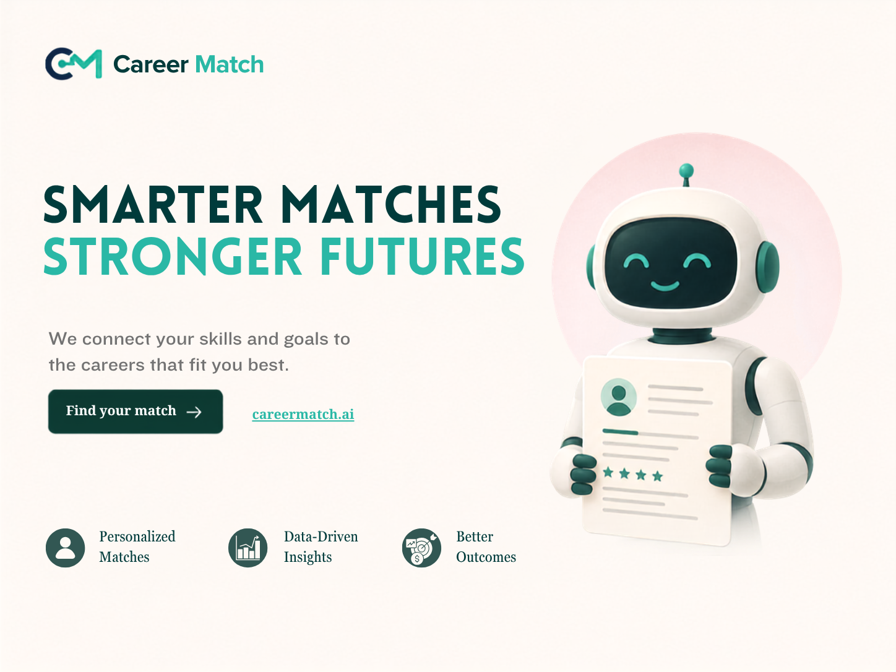

# Career Match



Explainable ML-powered resume-to-job matching.

Career Match turns the original Resume Screening notebook prototype into a
maintainable monorepo: a Python ML package, reproducible dataset audits, and
automated tests. The original notebook, dataset, and cover image are
preserved under `legacy/`. `frontend/` is an early Career Match product
prototype built fresh in this repository; it is not a copy of an earlier UI.

Repository: [https://github.com/Emmanuella-t/career-match.git](https://github.com/Emmanuella-t/career-match.git)

## Current ML status

Career Match has three **development** matchers. Scores are 0–100 relevance
signals, not hiring probabilities and not production models.

| Matcher | What it combines |
| --- | --- |
| Lexical Baseline v0.1 | TF-IDF + catalog skill overlap |
| Semantic Matcher v0.1 | MiniLM sentence-embedding cosine |
| Hybrid Matcher v0.1 | semantic + TF-IDF + evidence-aware skills (negation / stuffing heuristics) |

Career Match separates **development evaluation** (v0.2) from a **frozen
holdout** (v0.3). Hybrid weights were chosen on v0.2 only.

### Frozen synthetic development holdout results (v0.3)

| Matcher | Precision@1 | Precision@3 | NDCG@3 | Pairwise |
| --- | ---: | ---: | ---: | ---: |
| Lexical Baseline v0.1 | 1.000 | 0.630 | 0.739 | 0.573 |
| Semantic Matcher v0.1 | 1.000 | 0.778 | 0.892 | 0.804 |
| Hybrid Matcher v0.1 | 1.000 | 0.778 | 0.848 | 0.824 |

These are **frozen synthetic holdout** results, not production quality.
Hybrid improved pairwise vs semantic on v0.3 while NDCG@3 trailed semantic;
that trade-off is documented in `reports/hybrid_matcher_v0_1_holdout.md`.

The older 16-pair v0.1 fixture is a sanity check only. Legacy notebook
category labels are not matching ground truth.

## ML experimentation

Compare matchers on v0.2 with `scripts/compare_matchers.py` and
`scripts/evaluate_hybrid.py`. Do not tune against v0.3. Sentence embeddings
require `pip install -e ".[semantic]"` or `.[dev]`. Importing `career_match`
does not download MiniLM.

## Evaluation benchmarks

| | v0.1 | v0.2 | v0.3 |
| --- | --- | --- | --- |
| Role | sanity-check fixture | development / error analysis | frozen holdout |
| File | `data/evaluation/dev_relevance_fixture.json` | `data/evaluation/dev_benchmark_v0_2.json` | `data/evaluation/holdout_benchmark_v0_3.json` |
| Size | 4 jobs × 4 resumes = 16 pairs | 8 jobs × 7 resumes = 56 pairs | 9 jobs × 8 resumes = 72 pairs |
| Use | smoke-test ranking | develop and analyze models | pre-hybrid holdout comparison |

```bash
python scripts/evaluate_baseline.py
python scripts/evaluate_benchmark_v0_2.py
python scripts/evaluate_holdout_v0_3.py
```

Do not tune lexical weights against v0.2 or v0.3 just to raise the score.
Holdout v0.3 should remain frozen during hybrid-matcher development.
Labels are not independently validated ground truth.

## Repository layout

```
career-match/
├── src/career_match/   ML package (data, parsing, extraction, matching, evaluation)
├── tests/              Pytest suite
├── scripts/            Audit, baseline demo, and evaluation runners
├── docs/               Architecture notes and model card
├── reports/            Generated audit and baseline evaluation output
├── experiments/        Reserved for later matching experiments
├── data/evaluation/    v0.1 sanity fixture, v0.2 development, v0.3 holdout
├── legacy/             Original notebook, CSV, README, and cover image
├── frontend/           Early Career Match product prototype (built fresh here)
└── .github/            CI
```

## Setup (ML)

Python 3.11+ is required.

```bash
git clone https://github.com/Emmanuella-t/career-match.git
cd career-match
python -m pip install -e ".[dev]"
pytest
ruff check .
python -c "import career_match; print('Career Match import successful')"
python scripts/audit_legacy_dataset.py
python scripts/run_baseline_match.py --sample
python scripts/evaluate_baseline.py
python scripts/evaluate_benchmark_v0_2.py
python scripts/compare_matchers.py
python scripts/evaluate_holdout_v0_3.py
python scripts/evaluate_hybrid.py --all
```

Installation uses `pyproject.toml`. There is no root `requirements.txt`.

## Live deployment

Live deployment: **in progress**

Architecture: hosted Next.js frontend → hosted FastAPI + MiniLM backend.
See [docs/deployment.md](docs/deployment.md) for install, startup, CORS,
environment variables, health/readiness, and cold-start notes.

Production backend install / start:

```bash
python -m pip install -e ".[api,semantic]"
python scripts/start_api_production.py
```

Production frontend build must set `NEXT_PUBLIC_API_URL` to the API origin.
Backend CORS must list the frontend origin via `CAREER_MATCH_CORS_ORIGINS`.

## Setup (API)

Install API extras (included in `.[dev]` for tests):

```bash
python -m pip install -e ".[dev]"
uvicorn career_match.api.app:app --reload --host 127.0.0.1 --port 8000
```

Or:

```bash
python scripts/run_api.py --reload
```

Production-style (no reload, `HOST`/`PORT`):

```bash
python -m pip install -e ".[api,semantic]"
python scripts/start_api_production.py
```

- Health: `GET /health` (does not load MiniLM)
- Ready: `GET /ready` (does not force MiniLM load)
- Match: `POST /api/v1/match`
- OpenAPI docs: `/docs`

Default matcher is **semantic**. Optional body field `matcher` may be
`semantic`, `hybrid`, or `lexical`. Importing the app does not download
MiniLM; the encoder loads on first semantic/hybrid request.

## Product access modes

| Mode | How | What you get |
| --- | --- | --- |
| **Guest** | Landing → **Try Career Match** → `/match` | 2 free successful analyses with the real matcher API; **no persistence** |
| **Authenticated** | **Log In** / **Sign Up** (Clerk) | Unlimited `/match`, dashboard with **saved resumes**, **match history**, and **saved jobs** (Neon Postgres) |

On a guest’s third analysis attempt, Career Match shows an auth gate
(Create Account / Log In / Not now) and keeps the current resume, job
description, and matcher selection in `sessionStorage` so work is not lost.

Authenticated users can:

- save and manage resumes (paste text; no PDF parsing yet)
- save job opportunities manually
- save a successful analysis via **Save analysis** (not automatic)
- open recent matches and history on `/dashboard`

Guest analyses are never written to the database. Empty dashboard lists
remain honest empty states when the user has no saved data.

**Auth:** [Clerk](https://clerk.com) via `@clerk/nextjs` — sessions and
protected `/dashboard`. **Persistence:** Neon Postgres via FastAPI,
SQLAlchemy, and psycopg (`DATABASE_URL` stays backend-only). Clerk JWT is
verified on persistence endpoints; public `POST /api/v1/match` remains
available for guests. See `migrations/README.md` and root `.env.example`.

Guest usage counting is still client-side for this milestone and is not
tamper-proof; production public enforcement should be server-backed.

## Try Career Match locally

Run both services:

**Terminal 1 — backend**

```bash
python -m pip install -e ".[dev]"
# Optional for persistence: set DATABASE_URL and CLERK_ISSUER (see .env.example)
uvicorn career_match.api.app:app --reload --host 127.0.0.1 --port 8000
```

**Terminal 2 — frontend**

```bash
cd frontend
cp .env.example .env.local   # add real Clerk keys for login/signup
npm ci
npm run dev
```

Open [http://localhost:3000](http://localhost:3000). Use **Try Career Match**
for guest mode, or **Log In** / **Sign Up** for the dashboard. Apply the
SQL in `migrations/0001_initial_persistence.sql` before expecting dashboard saves to succeed.
The match UI calls FastAPI `POST /api/v1/match` (`NEXT_PUBLIC_API_URL`,
default `http://localhost:8000`). API docs: `http://127.0.0.1:8000/docs`.

## Setup (frontend)

Node.js 22+ and npm:

```bash
cd frontend
npm ci
npm test
npm run lint
npm run typecheck
npm run build
npm run dev
```

The product UI runs at `http://localhost:3000` and talks to the matching API.
Clerk publishable + secret keys are required for sign-in, sign-up, and
dashboard protection; guest `/match` still needs the keys present so
`ClerkProvider` can load (users may remain signed out).

## Legacy prototype

The starting point of this repository is a resume-category screening notebook
and a 169-row labeled CSV (25 job families). See
`legacy/README-original.md` and `docs/model-card.md` for what that artifact
can and cannot support.

## License

The original prototype README did not include a license file. Add one before
any public redistribution of the dataset if the upstream source requires it.
